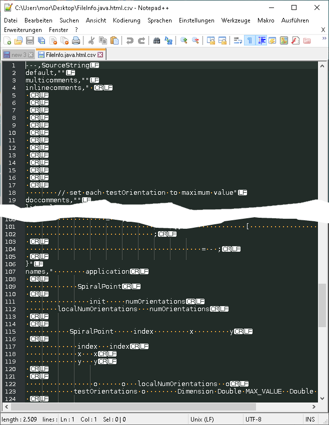
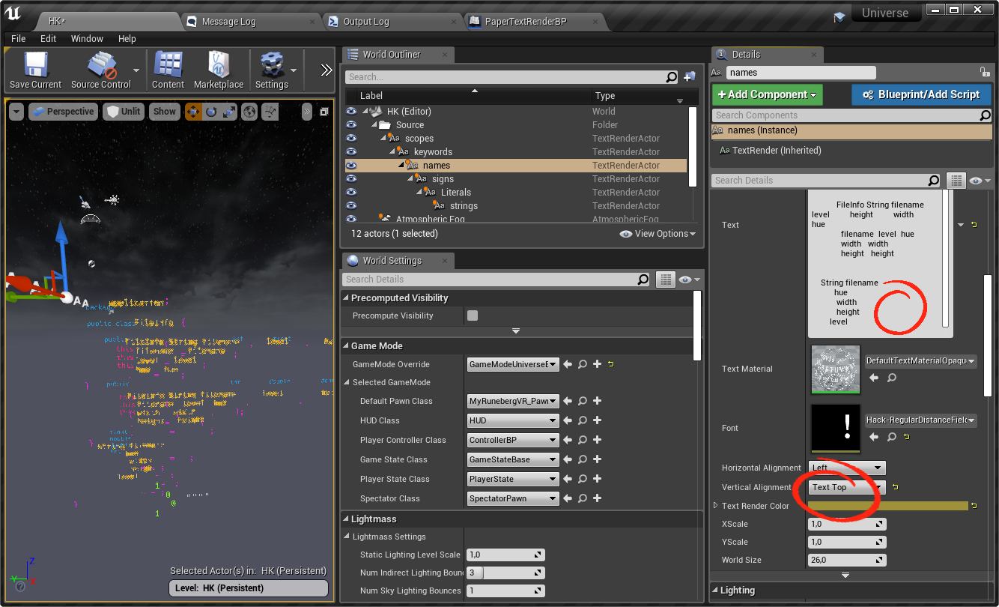

# Notepad++ formatted source code to UE4 Data Table converter

This small piece of code converts a source code formatted by [Notepad++](https://notepad-plus-plus.org) (NPP) into a [UE4](https://unreal-engine.com) [Data Table](https://docs.unrealengine.com/en-US/Gameplay/DataDriven/index.html). Each each source code color will be exported into a separate data set, each sign of other colors will be replaced by a space. 

## Background

Personally, I used the tool to convert Java source code to UE4 `Data Tables`, but with some effort it will also be possible to convert source code of other languages to `Data Tables` or to UE4 [`String Tables`](https://docs.unrealengine.com/en-US/Gameplay/Localization/StringTables/index.html) as long as you find a fitting NPP color scheme , see following sections.

| Original in NPP: <br />*FileInfo.java* | exported HTML: *FileInfo.java.html* | converted to UE4 Data Table:<br />*FileInfo.java.html.csv* |
| :------------------------------------: | :---------------------------------: | :--------------------------------------------------------: |
|  |       |          |

## In UE4

In UE4, I used the CSV files containing the splitted source code to create a layered source code visualization with `Text Render Actors` in layers. 

### Font

You have to create and use a mono-spaced font to display the source code elements in layers. For that, I created a [_distance field_](https://www.youtube.com/watch?v=EK-fByHbt8M) of the [_Hack_](https://sourcefoundry.org/hack/) font. Off course, you can use other fonts as well. 

### Demo

My resulting level looked like shown below. For this simple demo I just copied the texts into Text Render Actors and changed some parameters by hand - here: color and horizontal alignment. In real life, I did this in the construction script of a new so called _SourceCode_ actor.



## How to

1. Load the source code with Notepad++ and--if not already selected--select the appropriate source code formatter.

2. Use the extension _NPPExport_ to export the formatted source code to a HTML file.
  
3. Start the _NPPFormatingToUE4DataTable_ program of this repository and select the exported HTML file(s). Each HTML file will be converted in a CSV file containing a UE4 data table structure. The name of the CSV file will be the same as the original file extended with ".csv". 
4. Move these CSV files into the content folder (or a subfolder). These file will be imported automatically into UE4. While importing UE4 ask you to select the data structure of the CSV file. 
   
5. The data structure _SourceTable_ has to be defined as follows:
   

## UE4 String Table

The basic structure used by this conversion function is the same as used by the [UE4 String Table Asset](https://docs.unrealengine.com/en-US/Gameplay/Localization/StringTables/index.html). `String Table` assets won't neither be imported nor updated automatically, so it could be a little bit annoying depending what you want to use the CSV files for and how many CSV files you have to import. You have to create a `String Table` asset in the editor and import the data by hand using the provided _import from csv_ button. 

Interestingly the import functions for `String Tables` and `Data Tables` seems to work a little bit different: 

* For `String Tables`, the first column has to be named Key. For `Data Tables`, the name of the first column is not in defined--the first column will be used as key column. You can simply switch the comments of the following lines:

  ```Java
  writer.write("---,SourceString\n");
  // writer.write("Key,SourceString\n"); // for String Table export
  ```

* There are differences in interpreting special characters and quotation marks. In the _NPPFormatingToUE4DataTable_ program you can activate the conversion to `String Table` format by switching the comments of the following lines:			       				

  ```java
  //	// UE4 String Table Format
  //	// replacements to fit UE4 format
  //	theText = theText.replace("\\", "\\\\"); // \ -> \\
  //	theText = theText.replaceAll("\\r\\n|\\r|\\n", "\\\\r\\\\n"); //"\\r\\n"); // \n ->\r\n
  //	theText = theText.replace("\"", "\\\"\""); // " -> \""			
  //	theText = theText.replace("'", "\\'"); // ' -> \'	
  		        				
  // UE4 Data Table Format
  // replacements to fit UE4 format
  theText = theText.replaceAll("\\r\\n|\\r|\\n", "\r\n"); // \n ->\r\n 
  theText = theText.replace("\"", "\"\""); //   replace quotation marks:  " -> ""								
  						
  ```

* The values of the key column have to be quoted for `String Tables`, so just switch the comment signs of the following lines:

  ```java
  output += color2Type[sourceColorization].replace(" ", "");			
  //output += "\"" + color2Type[sourceColorization].replace(" ", "") + "\""; // for UE4 String Table
  ```

* It seems to be important to always have at least one character in each line, otherwise under some conditions the text will be displayed larger than necessary (tested with UE4.22 and _ScaleX_ and _ScaleY_ scaled `Text Render Actors`). For that the output will be optimized so that both empty lines at the end and sequences of spaces and tabs at the end of each line will be removed:

  ```Java
  // replace space and tab before \r\n
  sourceString = sourceString.replaceAll("[ \t]+(\r\n)", "$1");
  	        			
  // remove sequences of \r\n before end of text
  sourceString = sourceString.replaceAll("[\r\n]+$", "");
  	        				        		   		
  // insert space at position 0 in empty lines ( for UE4 Text Render Actor )
  sourceString = sourceString.replaceAll("\n\r", "\n \r"); // keep attention: \n\r instead of \r\n to grab all case in one run
  	        			
  // insert space at position 0 in the first line if the sourceString starts with a newline
  if (sourceString.length() > 0 && sourceString.charAt(0) == '\r')
  		sourceString = " " + sourceString;
  ```

### Missing colors

Depending on your source code some colors may be missing in the output (for instance, the sample class don't use comments, so the data sets for comments will be finally empty. ) 

### Names of colorization

I not sure, if I found all color classes and named them right. Especially if you work with source codes of different programming languages than Java the naming of the colors might be wrong. You can easy fix it by rework the list of color classes. I spend not much time in this list. 

```Java
final static String color2Type[] = new String[] {
	  			"default", // 0
	  			"multicomments", // 1
	  			"inlinecomments", // 2
	  			"doccomments", // 3
	  			"literals", // 4
	  			"keywords", // 5
	  			"string", // 6
	  			"unused7", // 7 
    ...
```


## Alternatives

* Alternative to displaying one `Text Render Actor` per color, it might be possible to create a material flexible enough to display different colors depending on the location of each letter in 3D space. That way, it might be sufficient to use only one `Text Render Actor`.
* Using `UMG` is another alternative. The new [UMG Rich Text Block](https://docs.unrealengine.com/en-US/Engine/UMG/UserGuide/UMGRichTextBlock/index.html) makes it possible to display styled text in a text area. I tested this attractive way, for me it was to slow (I had to display hundreds of source codes).
* Changing the `Text Render Actor` itself may be another possibility...
